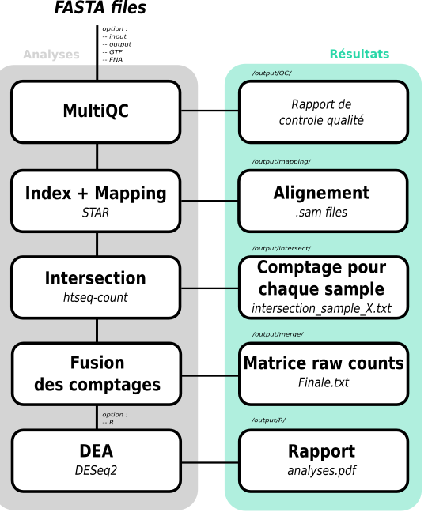

# DE-nf  : Pipeline V1.0
## Un pipeline nextflow pour réaliser une analyse d'expression différentielle RNAseq sur un ensemble d'individus.
[](https://hub.docker.com/r/lipinskiboris/de-nf/)
[](https://singularity-hub.org/collections/5269)


<p align="center" width="100%">
    
</p>


## Description
Ce pipeline a été développé en vue de réaliser des analyses RNAseq complètes à partir de fichiers FASTA issus de séquençage NGS.

Voici un résumé de la méthode :
- Réalisation d'un index (optionnel).
- Alignement des reads sur le génome de référence.
- Intersection des fichiers SAM sur l'annotation de référence.
- Élaboration de la matrice finale de comptage brute.
- Analyse d'expression différentielle sur R via le package DESeq2.

Veuillez consulter la section "Usage" pour tester le pipeline avec un ensemble de données.

## Dépendences
Le pipeline est fonctionnel sous les distributions de Linux.

1. Ce pipeline est entièrement basé sur l'utilisation de [Nextflow](https://www.nextflow.io). Il est fortement recommandé de prendre connaissance de son [installation](https://www.nextflow.io/docs/latest/getstarted.html) et de son utilisation avant d'exécuter le pipeline.

2. Software à installer : 
    - STAR (version 2.7.7a)
    - BWA (version 0.7.17-r1188)
    - samtools (version 1.9)
    - fastqc (version 0.11)
    - multiqc (version 1.8)
    - htseq-count (version 0.13.5)
    - R (version 4.0.3)
    - Package R : DESeq2, edgeR, pheatmap, RColorBrewer, ggbeeswarm, genefilter, biomaRt, stringr, ggplot2, NMF, tidyverse.
 


3. Fichier complémentaire nécessaire :
    - Fichier d'annotation GTF : [hg38](https://hgdownload.soe.ucsc.edu/goldenPath/hg38/bigZips/latest/) ou [Aedes albopictus](https://ftp.ncbi.nlm.nih.gov/genomes/all/annotation_releases/7160/102/GCF_006496715.1_Aalbo_primary.1/GCF_006496715.1_Aalbo_primary.1_genomic.gtf.gz)
    - Fichier FNA pour l'index : [hg38](https://hgdownload.soe.ucsc.edu/goldenPath/hg38/bigZips/genes/) ou [Aedes albopictus](https://ftp.ncbi.nlm.nih.gov/genomes/all/annotation_releases/7160/102/GCF_006496715.1_Aalbo_primary.1/GCF_006496715.1_Aalbo_primary.1_genomic.fna.gz)
    - Fichier XLS : Métadonnée (voir dossier data/ pour Aedes albopictus)


4. Autre : 
Des containers Docker et Singularity ont également été élaboré en vue de permettre aux utilisateurs de lancer le pipeline sans avoir à installer toutes les dépendances nécessaires de la partie 2. Les installations des outils [Docker](https://docs.docker.com/engine/install/ubuntu/) et [Singularity](https://singularity.lbl.gov/install-linux) sont nécessaire au préalable. Voir la dernière section de "Usage" pour plus de détails.


## Input
  | Type      | Description   |
  |-----------|---------------|
  | Fichier FASTA/FASTQ | Corresponds aux fichiers FASTA/FASTQ d'intérêt compressés au format .gz. |


## Paramètres

* #### Paramètres obligatoires :
    | Nom      | Exemple | Description     |
    |----------|---------|-----------------|
    | --input  | /input/ | Chemin vers le dossier où se trouvent les fichiers FASTA à utiliser pour l'analyse. Assurez-vous de n'avoir que les fichiers FASTA d'intérêts dans ce dossier et rien d'autre. |
    | --output | /output/| Chemin vers le dossier où se trouveront les différents résultats issus du pipeline. |
    | --GTF    | /data/fichier.gtf | Chemin où se trouve le fichier d'annotation à utiliser pour l'index via STAR et l'intersection via htseq-count. |


* #### Paramètres obligatoires complémentaires pour l'index :
    | Nom       | Exemple | Description     |
    |-----------|---------|-----------------|
    | --index | /data/index | Chemin vers le dossier où se trouve l'index STAR à utiliser pour le pipeline. Si cette option n'est pas utilisée, merci de vous assurer de fournir l'option --FNA en plus de l'option --GTF pour réaliser l'index. Par défaut, null. |
    |  | Ou bien : |  |
    | --FNA     | /data/fichier.fna | Chemin où se trouve le fichier .fna à fournir obligatoirement pour réaliser l'index si l'option --index n'est pas fourni. |


* #### Paramètres optionelles/complémentaires :
    | Nom      | Exemple | Description     |
    |----------|---------|-----------------|
    | --mapper | STAR/BWA| Mapper à utiliser. Par défaut BWA (MEM).|
    | --thread | N       | Nombre de thread à utiliser pour le pipeline. Par défaut 1.|
    | --R      | on/off  | Option pour réaliser ("on") ou non ("off") l'analyse d'expression différentielle sur R par défaut sur pipeline. Par défaut, off. |
    | --metadata | /data/metadata.xls | Chemin où se trouve le fichier de métadonnées à utiliser pour l'analyse d'expression différentielle sur R. Obligatoire si l'option --R est mis sur "on" |


## Usage
1. Lancement basique du pipeline, dans le cas où toutes les dépendances sont installées localement.

  ```
  nextflow run Lipinski-B/DE-nf --input /input/ --GTF /data/fichier.gtf --FNA /data/fichier.fna --output /output/
  ```
  
  La matrice de comptage résultant correspond au fichier finale.txt dans le dossier "/output/merge/finale.txt". 
  
  Un script DE.R est mis à votre disposition dans le dossier "bin/" de ce répertoire git, afin de vous permettre de réaliser par vous-même l'analyse de l'expression différentielle. Vous aurez donc besoin de la matrice finale pour terminer l'analyse mais aussi d'un fichier XLS répertoriant les métadonnées des échantillons d'intérêts. 
  
  Le script DE.R se lance comme ceci :
  
  ```
  Rscript bin/DE.r finale.txt /data/Metadata.xls
  ```

  Vous pouvez utiliser votre propre fichier XLS, dans ce cas il est recommandé de suivre comme template le fichier "Metadata.xls" que vous trouverez dans le dossier "data/" de ce répertoire. Le but ici étant de pouvoir permettre à l'utilisateur de réaliser ses propres analyses exploratoires d'expression différentielle à partir du template fourni dans le script DE.R


2. Vous pouvez également lancer le pipeline avec la réalisation d'une analyse d'expression différentielle par défaut sur R de façon automatique, via l'option --R.
  ```
  nextflow run Lipinski-B/DE-nf --input /input/ --GTF /data/fichier.gtf --FNA /data/fichier.fna --R on --metadata /data/metadata.xls --output /output/
  ```
  Un rapport sera mis à votre disposition dans le dossier "/output/R/". 


3. Dans le cas où toutes les dépendances sont installées localement et vous souhaitez utiliser votre propre index STAR pour l'analyse, vous pouvez suivre cette procédure. Attention pour des raisons de compatibilité, l'index ajouté avec l'option --index doit être réalisé avec la même version du mapper que celle utilisée pour l'alignement.

  ```
  nextflow run Lipinski-B/DE-nf --input /input/ --GTF /data/fichier.gtf --index /data/mapper_index --output /output/
  ```


4. Enfin vous pouvez lancer le pipeline via l'utilisation de containers Docker/Singularity via l'option -profile.
  
  ```
  nextflow run Lipinski-B/DE-nf -profile docker --input /input/ --GTF /data/fichier.gtf --FNA /data/fichier.fna --output /output/
  ```
  ou

  ```
  nextflow run Lipinski-B/DE-nf -profile singularity --input /input/ --GTF /data/fichier.gtf --FNA /data/fichier.fna --output /output/
  ```


## Contributions

  | Name      | Email | Description     |
  |-----------|-------|-----------------|
  | Lipinski Boris    | boris.lipinski@etu.univ-lyon1.fr | Developeur à contacter pour support |
